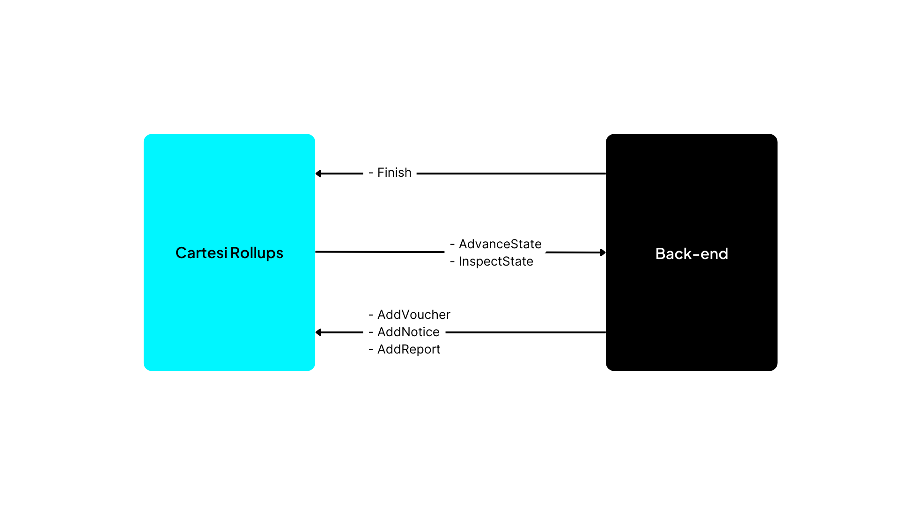

# Tofen Payment Solutions (TPS)

Tofen Payment Solutions is a Software as a Service (SaaS) platform that utilizes blockchain technology to enhance the efficiency of international financial transactions. Our core operation involves converting national currencies from initial payments into ERC20 tokens destined for the digital wallets of final receiving financial institutions. This reduces transaction processing time, operational costs such as exchange rates, and strengthens the security of operations.

Slogan: Tofen, smoother international financial transactions with tokens!

## Motivation

International financial transactions face significant challenges such as high fees, hidden costs, transactional delays, and risks of fraud and security breaches.

### High fees and hidden costs

High fees charged by banks and financial intermediaries, coupled with hidden costs like exchange rates, increase the overall transaction cost.

### Slow processing

International transactions typically take longer to process due to the involvement of multiple intermediaries and compliance with cross-border regulations.

### Fraud and security risks

International transactions are prone to higher risks of fraud and fraudulent activities due to the complexity and lack of standardization in global financial systems. Personal and financial information security during the transfer process is also a concern.

### Technical challenges

Issues, roadblocks, or any other feedback in the development lifecycle can be identified in various areas. One such point of focus is currency conversion, where the question turns to which smart contracts can be implemented to automate the conversion process and how to handle currency fluctuations.

Another critical aspect is compliance with international regulations, which can result in fines and penalties from regulatory authorities, increasing operational costs for financial institutions. Non-compliance can also lead to loss of trust from customers and investors, negatively affecting the institution's reputation and reducing its customer base.

Furthermore, scalability and maintenance of the solution are significant challenges to address. It is essential to ensure that the developed solution can handle an increase in transaction volume and expansion into international markets. Measures must be taken to ensure the continuous maintenance and support of the solution after the initial implementation, using the development resources offered by the Cartesi platform and its community of developers.

## Target Audience

Multinationals engaged in e-commerce and financial institutions.

## Value Proposition

In an increasingly digitized world, the demand for secure, efficient, and cost-effective financial solutions is essential. In this context, blockchain-based digital currencies emerge as a robust response, incorporating principles of cryptography, decentralization, and transparency to ensure a reliable environment for financial transactions.

By eliminating unnecessary intermediaries and streamlining processes, these solutions not only reduce operational costs but also offer a faster and more economical alternative for international transactions, positively impacting the consumer experience.

### Secure currency

Blockchain-based digital currencies provide a secure and reliable environment for conducting financial transactions, incorporating fundamental principles of cryptography, decentralization, and transparency.

### Cost reduction

The integration of the payment network not only increases trust among stakeholders but also significantly reduces costs by eliminating unnecessary intermediaries and simplifying the transaction process. This results in operational savings and makes financial services more accessible and efficient.

### Transaction time reduction

The automation and efficiency of smart contracts reduce the time required to process international transactions, offering a faster and more economical alternative to traditional payment methods.

## Solution Architecture


The solution relays on the basic purpose of Cartesi Dapps, which is:

- Execute routes provided by the dApp deployed in the Cartesi layer via Cartesi virtual machine;
- Obtain resultant voucher from those executions;
- Execute those vouchers to submit, in fact, the transactions in layer 1 Ethereum Blockchain of developers' choice;

This scenario is illustrated as in the following image (available in https://docs.cartesi.io/cartesi-rollups/http-api/):



There were made three smart contracts for the EVM layer 1 network in this use case (which can be found within **Hardhat** project, located in the **hardhat** folder). The follows the ERC-20 patter for fungible tokens, and brief description of them follows:

- **CommonCurrency**: represents a common currency for commerce among two or more countries. In this scenario, only two are exemplified. Highlights by two methods of this contract, which are mint (generation of tokens of the contract) and transferFrom (transfers unities of the token from one EVM address to another).

- **CurrencyCountryA**: token which represents a fiduciary currency of a country A. There are some important methods to notice in it, such as:
    - **setConversionRate**: sets a conversion rate from token **CurrencyCountryA** to some other, represented by the input address of the method (in this case, would be the common currency previously described address);
    - **convertToCommonCurrency**: converts token unities of **CurrencyCountry** from the invoker's balance to the common currency token (represented by the parameter **_targetCurrency**, which is a address);
    - **withdrawCommonCurrency**: withdraws token unities of **CurrencyCountry** from the common currency token contract(represented by the parameter **_targetCurrency**, which is a address) to the invoker's balance;

- **CurrencyCountryB**: replica of **CurrencyCountryB**, but for another country B;

### Minimum Requirements

To execute the project, it is necessary to have installed:

- Node.js installed;
- Docker;

### Installation and Configuration

To configure the project, it is necessary to install **Sunodo CLI**, which can be done by runnig:

```bash
npm install -g @sunodo/cli
```

After that, move to **cartesi-hackathon/cartesi** directory, and run:

```bash
sunodo build
```

If the Docker image of the dApp is built successfully, run:

```bash
sunodo run
```

This will deploy the dApp inside the Cartesi Rollup server together with a local EVM Foundry network, a GraphQL query server, an explorer application (to inspect the state of the Cartesi network) and a inspect server (from which is possible to query artifacts produced by rollup advance operations, such as notices, vouchers and reports).

After that, it is necessary to deploy the three ERC-20 contracts previously mentioned, which hold the core business logic of the use case. This can be done by a sort of ways (such like through the Hardhat scripts project aiming to the Foundry network connected to the Rollup Server, or even using Remix IDE, per example).

### Interactions with Cartesi

The idea provided by Toffen Payment Solutions would be suitable for Cartesi platform comparing to traditional EVM blockchain platforms, such like Ethereum, due to its gains of performance and prize when executing transactions. However, it is important to notice that there are currently other networks which solve questions of gas price, such as Polygon (in which gas costs something in order of cents of dollar). 

For this specific scenario, there are some platforms to create private blockchain EVM networks, such as **Hyperledger Besu** (https://www.hyperledger.org/projects/besu) and **ConsenSys Quorum** (https://consensys.net/Quorum/). These two solutions also solves issues of performance and costs, since they can build small networks with more efficient consensus protocol (such like Byzantine Fault Tolerance ones) and with gas price set to any value defined by the network administrator (including zero). Also, since they can offer privacy to the network, avoid generic agents to enter and validate transactions in it, in corporate use cases (which, in general, are more restrict),they could also be adopted.

Despite of those considerations, there can be also requirements that force the solution to be hosted in a public network, for effects of transparency in a public international context like the one presented. Considering this additional feature, Cartesi could a good fit for the use case provided by Toffen Payment Solutions, also due to its advantages previously mentioned.

## Demonstration

https://streamyard.com/ejtbvuejyi78q5pi

## Innovation

Tofen Payment Solutions innovated by integrating blockchain technology into a SaaS platform to enhance the efficiency of international financial transactions.

By converting national currencies into ERC20 tokens for the digital wallets of final receiving financial institutions, the company reduces transaction processing time, associated operational costs such as exchange rates, and enhances the security of financial operations.

The adoption of the solution is intuitive and straightforward. The technology was precisely designed to increase trust among network payment agents. This allows multinational companies involved in e-commerce and financial institutions to have a better experience when conducting operations.

This innovative approach promotes a faster, more economical, and secure solution for international financial transactions.

## Business Model and Market Viability

Tofen Payment Solutions adopts the Software as a Service (SaaS) business model, providing an innovative solution for international financial transactions, with a focus on the Web3 ecosystem.

With SaaS, customers enjoy a subscription-based approach, eliminating the need for heavy investments in IT infrastructure and reducing initial costs.

Hosted in the cloud, our software offers remote access, allowing users to access the platform from anywhere with an internet connection, ensuring flexibility and convenience.

The inherent scalability of the SaaS model allows us to adapt to the constantly evolving needs of our customers, while our integration with the Web3 ecosystem opens doors to new value opportunities, such as the possibility of using tokens from their own countries and ERC20 tokens.

With a clear and transparent tokenomics structure, we aim to create a sustainable dApp that promotes adoption and active participation within the ecosystem, further driving value for our users.

In summary, our SaaS approach provides a significant competitive advantage by offering a flexible, affordable, and cutting-edge solution to meet the needs of the international financial transaction market.

### Directors

#### Luciano Augusto Campagnoli da Silva: Bank Technology Agent.

#### Pamela Cristina Cedro: Fintech Product Manager.
